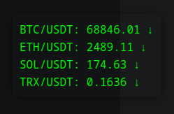

# Brypto Price Tracker


A simple, frameless, always-on-top desktop widget that displays real-time prices from Binance.

[Original in go](https://github.com/zewebdev1337/price-tracker-widget)

## Features

* **Frameless and Always-on-Top:** Designed to be unobtrusive and stay visible while at work.
* **Customizable Symbols:** Add symbols to track to `~/.pricetrack.json`.
* **Real-Time Updates:** Prices are updated every 2 minutes.
* **Draggable:** Easily move the widget around your screen by dragging it.
* **Color Toggle:** Right-click on the widget to toggle between magenta and green text color.

## Installation

1. **Prerequisites:**
   * C++17
   * Qt (5.15 or higher)

1. **Clone the repository:**
   ```bash
   git clone https://github.com/zewebdev1337/brypto-price-tracker.git
   ```

2. **Build and install:**
   ```bash
   mkdir build
   cd build
   qmake ../widget.pro
   make
   ./price-tracker
   ```

    OR 

   ```bash
   ./scripts/deploy.sh # This will build the widget, place the binary at /usr/local/bin/, create and start a systemd service for it for the current user.
   ```

## Configuration

The widget reads the list of symbols to track from `~/.pricetrack.json`. 

**Example `~/.pricetrack.json`:**

```json
["TRX", "PEPE", "SOL", "BNB"]
```

If the configuration file does not exist, the widget will create one with the default symbols: `BTC`, `ETH`, `SOL`.
